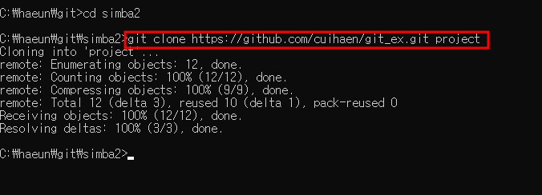
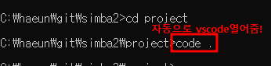
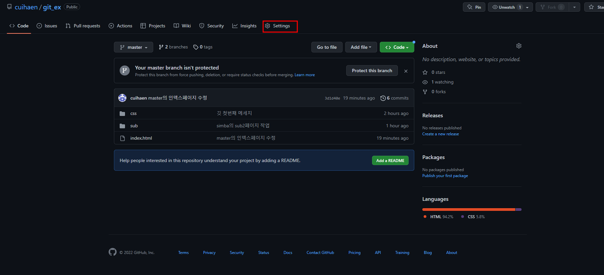
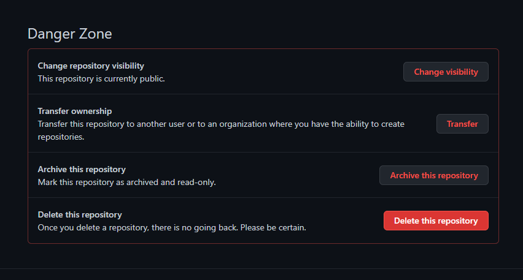
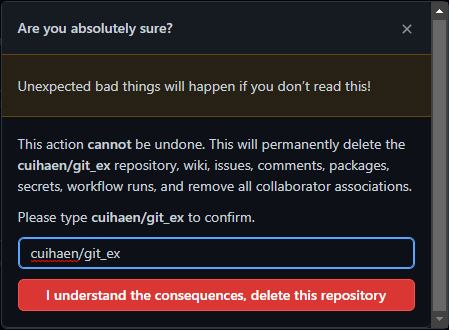

#### 🟡 초기세팅

`https://github.com/클론할 repository주소`  
→ 깃허브 내 code버튼을 클릭하고 깃허브 주소를 복사한 한다.

`cd 이동할 폴더명`
→ repository속 소스파일을 clone할 폴더로 이동한다.

`git clone https://github.com/클론할 repository주소`
→ 해당 repository파일들을 원하는 로컬 폴더에 복제한다.

`code .`  
→ 자동으로 VSCODE를 열어준다.  

---

📍 작업을 마치고 난 후

`git add .`  
→ 로컬폴더에서 작업을 통해 변경된 모든 파일/내용을 모두 Tracking한다.

`git commit -m "커밋할때 남길 메세지"`  
→ 어떤 변경사항이 있는지 파악하기 좋은 commit메세지를 달아준다.

`git push origin 브랜치명(권한을 부여받아 사용중인 브랜치명을 입력)`  
→ 실제 git에 push해 최신 변경사항이 반영되게 한다.(일반적으로는 master브랜치를 사용하지는 않음)

---

📍 branch 관련 명령어 모음

1. `git branch 브랜치명` → 새로운 브랜치 생성
2. `git branch` → 브랜치 목록 확인
3. `git switch 브랜치명(이동할 브랜치명)` → 해당 브랜치로 이동(\*checkout명령어가 Git 2.23버전부터 switch,restore로 분리 됨)
4. `git switch -c 브랜치명` → 브랜치 생성과 동시에 이동하기(\*기존의 `git checkout -b 새브랜치명`과 동일)
5. `git branch -d 브랜치명(삭제할 브랜치명)` → 브랜치 삭제하기(다른 브랜치로 가져오지 않은 내용이 있는 브랜치를 지울 때는 `-d`대신 `-D`로 강제삭제를 해주어야 함)
6. `git branch -m 기존브랜치명 새브랜치명` → 브랜치 이름 바꾸기
7. `git log --all --decorate --oneline --graph` → 여러 브랜치의 내역 편리하게 그래프 형태로 보기

---

📍 repository 삭제하는 방법

1. 해당 repository로 이동 후 상단 메뉴 중 가장 우측에 위치한 Settings를 선택.
   
2. 가장 하단으로 내리면 'Danger Zone'이라는 항목이 존재하는데, 해당 항목 중 최하단의 'Delete this repository' 클릭.
   
3. 해당 repository의 이름을 동일하게 한번 더 입력해주면 완전히 삭제할 수 있음.(github에 심은 잔디도 함께 날아가고, 되돌릴 수 없으므로 **신중한 선택**이 필요하다.)
   
