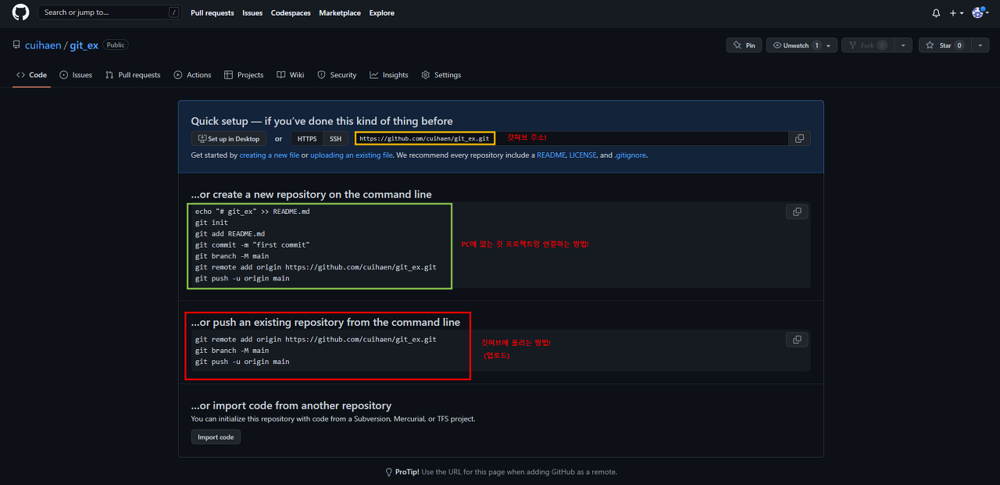

#### 🟡 초기세팅

`git init`  
→ 지정한 폴더 안에 `.git`폴더가 생성된다.

`git remote add origin https://github.com/자신의아이디/repository이름.git`  
→ github의 repository와 연결.

`git status`  
→ 현재 로컬 폴더와 git의 상태를 체크.

`git add .`  
→ 로컬폴더와 git repository 간의 변경된 모든 파일/내용을 모두 Tracking한다.

`git commit -m "커밋할때 남길 메세지"`  
→ 어떤 변경사항이 있는지 파악하기 좋은 commit메세지를 달아준다.

`git push origin 브랜치명(권한을 부여받아 사용중인 브랜치명을 입력)`  
→ 실제 git에 push해 최신 변경사항이 반영되게 한다.(일반적으로는 master브랜치를 사용하지는 않음)

---

📍 github에 계속해서 버전을 업데이트 하는 방법

1. 추가할 파일 더하기 ( `git add .` )
2. 히스토리 만들기( `git commit -m "커밋메세지"` )
3. 깃허브로 올리기( `git push origin 브랜치명` )

---

📍 github에 보다 발전한 버전의 파일이 있는 경우

1. `git pull origin 브랜치명`으로 파일을 내려받아 업데이트
2. 새로운 추가 작업 진행
3. `git push origin 브랜치명`으로 새롭게 추가작업한 버전의 파일 업로드
