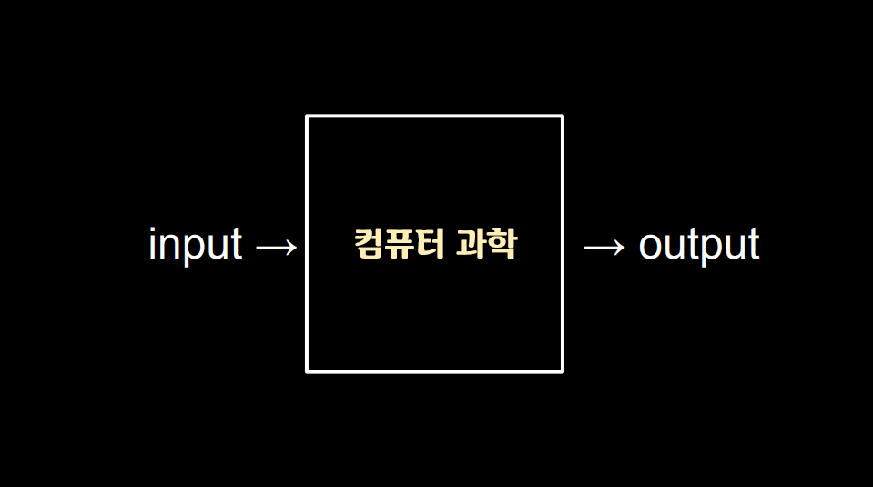
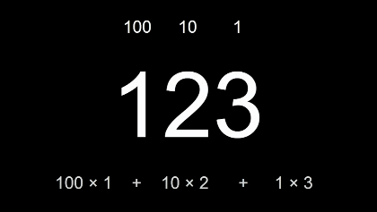
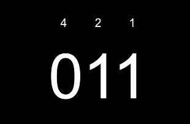
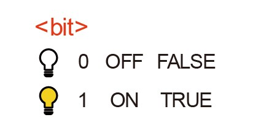

#### 컴퓨터 과학이란?

컴퓨터 과학은 **문제 해결**에 대한 학문이다.  
문제 해결은 입력(input)을 전달받아 출력(output)을 만들어내는 과정을 말하며, 그 중간에 있는 과정이 바로 '컴퓨터 과학'이다.

컴퓨터 과학을 거친 '입력'과 '출력'을 표현하기 위해서는 모두가 동의할 약속(표준)이 반드시 필요하다.

##### 🟡 표현방법

###### 1. 2진법

일상에서 0 ~ 9 총 10개의 기호(숫자)로 표현하는 것을 '10진법'이라 하며, 컴퓨터는 **오직 0과 1로만 모든 데이터(숫자, 글, 사진, 영상 등)를 표현**하는데 이를 **'2진법'**이라 말한다.

123을 '백이십삼'이라 읽는 이유는 1을 백의자리, 2를 십의자리, 3을 일의자리로 본다는 '약속'때문이다.  
일상 속에서 너무나도 당연하게 **'1x100 + 2x10 + 3x1 = 123'**이라고 할 수 있다.

10진법으로 표현 된 숫자를 읽을 때는 자리수를 10의 거듭제곱으로 표현하듯, 2진법에서는 2개의 숫자만 존재하므로 **각 자리수가 2의 거듭제곱**을 의미한다.

|            |  네 번째 자리   | 세 번째 자리 | 두 번째 자리 | 첫 번째 자리 |
| :--------: | :-------------: | :----------: | :----------: | :----------: |
| **10진법** | 10x10x10 = 1000 | 10x10 = 100  |  10x1 = 10   |      1       |
| **2진법**  |    2x2x2 = 8    |   2x2 = 4    |   2x1 = 2    |      1       |

즉 10진법의 3을 2진법으로 표현하면 '11'의 형태로 표현해볼 수 있다. 즉 2x1 + 1x1 = 3이라고 그 의미를 해석할 수 있다.

만약 2진법에서 '100'이라 표현 된 숫자를 보았다면 **2x2 + 2x1x0 + 1x1x0 = 4를 의미**하는 것으로 쉽게 해석 해볼 수 있다.

이와 같은 2진법의 방식은 전기를 통해 연산되는, 즉 켜고 끄는 방식으로 작동되는 컴퓨터에 매우 적합한 방법이며, 스위치(트렌지스터)의 on/off상태를 0과 1을 통해 표현하게 된다.

컴퓨터에서 2진법에서 하나의 자릿수를 표현하는 단위를 **bit(비트)**라고 한다.

###### 📍 비트

정보를 저장하고 연산을 수행하기 위해 컴퓨터는 비트(bit)라는 측정 단위를 씁니다. 비트는 이진 숫자라는 뜻을 가진 “binary digit”의 줄임말이며, 0과 1, 두 가지 값만 가질 수 있는 측정 단위입니다.

디지털 데이터를 여러 비트들로 나타냄으로써 두 가지 값만을 가지고도 많은 양의 정보를 저장할 수 있습니다. 또한 컴퓨터는 저장되어 있는 데이터를 수정하기 위해 비트에 수학적 연산을 수행할 수 있습니다.

###### 📍 비트열

하나의 비트는 0과 1, 이 두 가지의 값만 저장할 수 있습니다. 컴퓨터 내부에서 물리적 표현될 때는, 켜고 끌 수 있는 스위치라고 생각할 수 있겠습니다. (켜기=1, 끄기=0)

하지만 비트 한 개는 많은 양의 데이터를 나타내기에 턱없이 부족합니다. 그렇기 때문에 여러 숫자 조합을 컴퓨터에 나타내기 위해 비트열을 사용합니다. 바이트(byte)는 여덟 개의 비트가 모여 만들어진 것입니다. 하나의 바이트에 여덟 개의 비트가 있고, 비트 하나는 0과 1로 표현될 수 있기 때문에 2^8 = 256 개의 서로 다른 바이트가 존재할 수 있습니다.

바이트가 모이면 더 큰 단위가 될 수 있습니다. 킬로바이트는 1,000 바이트, 메가바이트는 1,000 킬로바이트(100만 바이트), 기가바이트는 1,000 메가바이트(10억 바이트)입니다. 테라바이트는 1,000 기가바이트(1조 바이트)이며, 심지어 페타바이트와 엑사바이트와 같은 더 큰 단위도 존재합니다.

  다양한 데이터 표현하기

하나의 비트로는 어떠한 값이 참인지 거짓인지에 대한 정보만 컴퓨터에 저장 가능.

하나의 바이트(8 bit) = 알파벳 하나.

1 KB = 몇 문단의 문자.  
1 MB = 1분가량의 노래 파일.  
1 GB = 약 30분 길이의 HD 영화.

---

출처 : boostcourse - 👉🏻 [모두를 위한 컴퓨터 과학(CS50 2019)](https://www.boostcourse.org/cs112)
