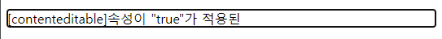

#### 🟡 Contenteditable

- 일반적으로 편집할 수 없는 <p>요소도 contenteditable속성으로 지정되면 편집할 수 있는 요소가 된다. 인터넷익스플로러 전용 속성이었지만 HTML5에서 채택되었다. 변경한 내용을 처리하기 위해서는 별도의 기능을 자바스크립트로 서버측 프로그램을 통하여 구현해야 한다.  
<br>


```
<p contenteditable="true">
   [contenteditable]속성이 "true"가 적용된 요소입니다.
</p>
```

  

<br>  

#### 🟡 Draggable

- 지정된 요소를 드래그 할 수 있게 한다. 웹 브라우저 외부로까지 드래그가 가능하다.(저장) 
- 현재 대다수의 브라우저가 기본 기능으로 지원하고 있다.(기본값은 'true')
- 이미지는 복사되고 링크는 바로 가기가 된다. 
<br>

    ```
    <div>
        
        <a href="http://cafe.naver.com/greenjob">그린 기업실무반</a>
    </div>
    <div>
            
            <a href="http://cafe.naver.com/greenjob">그린 기업실무반</a>
    </div>
    ```   

<br>  


#### 🟡 Hidden

- CSS를 사용하지 않고도 HTML내에서 요소를 숨길수가 있다.
- CSS가 제거하는 것과 같은 효과를 내는 것이라면 [hidden]은 HTML내에서 완전히 제거하는 것과 같은 기능이다.(=display:none)
- 리더기가 읽어주지 않게 되므로 웹 접근성에 적합하지 않은 태그로 리더기가 읽어야하는 요소에는 사용 안함!


  ```
    <div>
        <p hidden="hidden">
        이문장은 [hidden] 속성이 적용 되었습니다.
        </p>
    </div>  
  ```

<br>  

#### 🟡 Spellcheck

-서식요소나 contenteditable 속성을 사용하여 편집 가능한 상태의 요소를 편집할 때 맞춤법 검사를 하도록 하는 속성.  영어만 확인가능하므로 사실상 실용성은 없음.  

  ```
    <div>
        <textarea spellcheck="true"></textarea>
    </div> 
  ```


