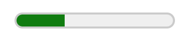
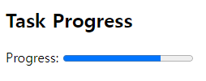
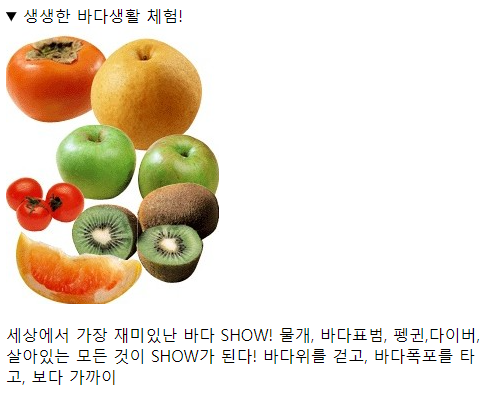

#### 🟡 Meter

* 분량이나 수량을 나타낼 때 사용 (min, max, value)
* 월급,점수,득표율과 같은 특정한 범위에 속하는 숫자로 된 값을 표현.
* 최대/최소의 범위,분표별 범위,이상적인값표기가능, 스크린 리더기나 툴 팁등에 표현가능
<br>

  ```
  <meter id='disk-usage' 
      title='기가바이트' 
      max='1500' 
      min='0' 
      value='460'>
      <span class='total'>1500</span>GB 중
      <span class='used'>460</span>GB 사용 중
  </meter>
  ```

  

<br>  

#### 🟡 Progress

* 현재 진행중인 상태를 표시 
* 글로벌 속성과 함께 자체적으로 2개의 속성만을 가지고 있음. 게이지에 적합한 태그는 `<meter>` 태그임. 
<br>

    ```
    <section>
      <h2>Task Progress</h2>
      <p>Progress:
        <progress value="75" max="100">3/4 complete</progress>
      </p>
    </section>
    ```   
  

<br>  


#### 🟡 Details  

* 사용자가 확인 할 수 있는 추가 정보를 나타낼 수 있다. 
* 각주로 활용하기에 편리한 태그 
* `<details>`태그는 `<summary>`태그와 함께 사용됨 
* 기본적으로 ‘감춤’ 상태 `<summary(블럭요소)>` 부분만 보이도록 되어 있다. 
* 펼쳐놓기 위해서는 open="open" 속성을 넣어주면 된다.(기본값은 close,별도로 open입력 생략 시 닫혀있음.)
- 개별적인 디자인 변경 어려우므로 사용빈도 매우 낮음.
- 블럭요소


  ```
    <div>
        <p hidden="hidden">
        이문장은 [hidden] 속성이 적용 되었습니다.
        </p>
    </div>  
  ```
 
<br>  


